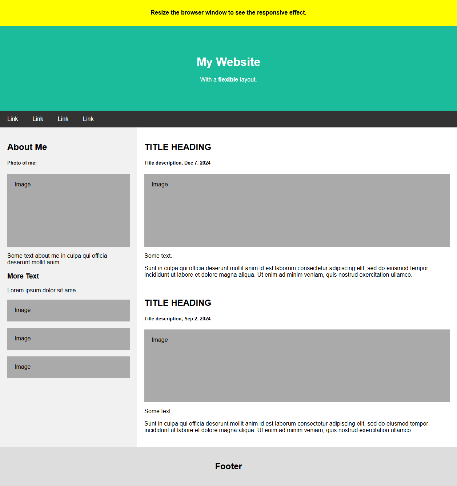

# Flexbox

Flexbox is a shortform of Flexible Box Layout

Flexbox contains of two parts

- Flex Container
- Flex Items

## Container

Container is a parent element of Flexbox. Its can be outer div.

```html
<div class="flex_container">
    <div class="flex-item">Item A</div>
    <div class="flex-item">Item B</div>
</div>
```

We define flex container through `display` property

```CSS
.container {
    display: flex; /* or inline-flex /*
}
```

## FlexBox container properties

FlexBox works with a set of properties. they are:

- flex-direction:
  - row - default
  - column
  - row-reverse
  - column-reverse
- flex-wrap: 
  - nowrap - default
  - wrap
  - wrap-reverse
- flex-flow: Short hand for flex-direction and flex-wrap
  - Example: `flex-flow: row wrap;`
- justify-content: Align items when they do not use all available space (Horizontally).
  - center
  - flex-start
  - flex-end
  - space-around
  - space-between
  - space-evenly
- align-items: Align items when they do not use all available space (vertically).
  - center
  - flex-start
  - flex-end
  - stretch
  - baseline
  - normal
- align-content: Align lines, in case there is a line break within container.
  - center
  - stretch
  - flex-start
  - flex-end
  - space-around
  - space-between
  - space-evenly

## Flexbox item properties

Direct child of flex container are flex items. Following properties applies to flex items:

- order: Specify order of item in a container. It is respective to other items
  - Example: `order: 7;`
- flex-grow: Define how much a flex item grows relative to other items
- flex-shrink: Specifies how much a flex item will shrink relative to the rest of the flex items
- flex-basis: Define initial length
- flex: Shorthand for flex-grow, flex-shrink, flex-basis
- align-self: It override the align-item property of container at item level

# Confusing parts

## Flex-grow, flex-shrink, flex-basis, flex

- Default values:
  - flex-grow: 0
  - flex-shrink: 1
  - flex-basis: auto
- flex is short hand of
  - flex-grow flex-shrink flex-basis
  - Default value: 0 1 auto
  - It is not mandatory to give all 3 values. Missing values will be taken as default. Example
    - `flex: 1` - will set it as `1 1 auto`
    - `flex: 0 0` - will set it as `0 0 auto`
- Flex-grow: When there is some free space available after putting items in container, flex-grow defines how that space will be filled by giving extra space to the items.
  - default value 0 says, items will not be enlarged to fill the space.
  - `flex-grow: 1` to all items will extend the width of all items evenly, to fill all the available space.
  - If there are three items and we give flex-grow as 2, 1, 1. Now assum there are 60 pixel left after placing items.
    - Ideally all should have grow by 20 pixel (if grow is 1).
    - However since item 1 is growing twice as compare to item 2 and 3, item 1 will grow by 30 pixel and item 2 and 3 will grow by 15 pixel.
> We use flex-grow as 0 on say images, when we do not want them to shrink while resizing the window.
- Flex-shrink is exactly same as flex-grow but it tell how items will shrink, in case they are taking more then available space.
- Flex-basis: Sets initial main size of a flex item.
  - Default value `auto` mean item will follow their default width property.
  - If we define it to something, say `flex-basis: 500px`, it will take precedence over width property.
> One use-case: We set `flex-basis: 0` so that it is as small as possible but we also set `flex-grow: 1` so that they evenly grow. This will make all items of equal size, regardless of their default width and content size. It is equal to `flex: 1 1 0`. 

## Example design

Example taken form w3schools

Let's say we want to make following design using flexbox.



However on mobile and tables (<700 px), we want it to be


HTML is available [here](./example.html) or have following code

```html
<!DOCTYPE html>
<html>
<head>
    <title>Page Title</title>
    <meta charset="UTF-8">
    <meta name="viewport" content="width=device-width, initial-scale=1">
    <style>
        * {
            box-sizing: border-box;
        }

        /* Style the body */
        body {
            font-family: Arial;
            margin: 0;
        }

        /* Header/logo Title */
        .header {
            padding: 60px;
            text-align: center;
            background: #1abc9c;
            color: white;
        }

        /* Style the top navigation bar */
        .navbar {
            display: flex;
            background-color: #333;
        }

        /* Style the navigation bar links */
        .navbar a {
            color: white;
            padding: 14px 20px;
            text-decoration: none;
            text-align: center;
        }

        /* Change color on hover */
        .navbar a:hover {
            background-color: #ddd;
            color: black;
        }

        /* Column container */
        .row {
            display: flex;
            flex-wrap: wrap;
        }

        /* Create two unequal columns that sits next to each other */
        /* Sidebar/left column */
        .side {
            flex: 30%;
            background-color: #f1f1f1;
            padding: 20px;
        }

        /* Main column */
        .main {
            flex: 70%;
            background-color: white;
            padding: 20px;
        }

        /* Fake image, just for this example */
        .fakeimg {
            background-color: #aaa;
            width: 100%;
            padding: 20px;
        }

        /* Footer */
        .footer {
            padding: 20px;
            text-align: center;
            background: #ddd;
        }

        /* Responsive layout - when the screen is less than 700px wide, make the two columns stack on top of each other instead of next to each other */
        @media screen and (max-width: 700px) {
            .row, .navbar {
                flex-direction: column;
            }
        }
    </style>
</head>
<body>

<!-- Note -->
<div style="background:yellow;padding:5px">
    <h4 style="text-align:center">Resize the browser window to see the responsive effect.</h4>
</div>

<!-- Header -->
<div class="header">
    <h1>My Website</h1>
    <p>With a <b>flexible</b> layout.</p>
</div>

<!-- Navigation Bar -->
<div class="navbar">
    <a href="#">Link</a>
    <a href="#">Link</a>
    <a href="#">Link</a>
    <a href="#">Link</a>
</div>

<!-- The flexible grid (content) -->
<div class="row">
    <div class="side">
        <h2>About Me</h2>
        <h5>Photo of me:</h5>
        <div class="fakeimg" style="height:200px;">Image</div>
        <p>Some text about me in culpa qui officia deserunt mollit anim..</p>
        <h3>More Text</h3>
        <p>Lorem ipsum dolor sit ame.</p>
        <div class="fakeimg" style="height:60px;">Image</div><br>
        <div class="fakeimg" style="height:60px;">Image</div><br>
        <div class="fakeimg" style="height:60px;">Image</div>
    </div>
    <div class="main">
        <h2>TITLE HEADING</h2>
        <h5>Title description, Dec 7, 2024</h5>
        <div class="fakeimg" style="height:200px;">Image</div>
        <p>Some text..</p>
        <p>Sunt in culpa qui officia deserunt mollit anim id est laborum consectetur adipiscing elit, sed do eiusmod tempor incididunt ut labore et dolore magna aliqua. Ut enim ad minim veniam, quis nostrud exercitation ullamco.</p>
        <br>
        <h2>TITLE HEADING</h2>
        <h5>Title description, Sep 2, 2024</h5>
        <div class="fakeimg" style="height:200px;">Image</div>
        <p>Some text..</p>
        <p>Sunt in culpa qui officia deserunt mollit anim id est laborum consectetur adipiscing elit, sed do eiusmod tempor incididunt ut labore et dolore magna aliqua. Ut enim ad minim veniam, quis nostrud exercitation ullamco.</p>
    </div>
</div>

<!-- Footer -->
<div class="footer">
    <h2>Footer</h2>
</div>

</body>
</html>

```